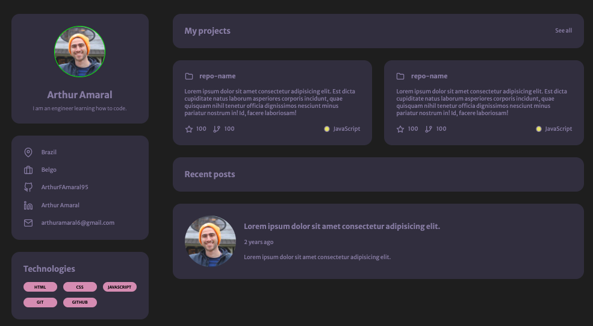
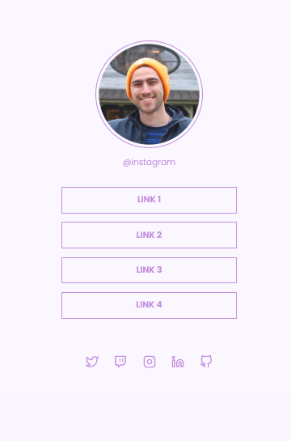

<h1>🚀 Rocketseat Challenges 🚀</h1>
<h3>
A repository to solve Rocketseat challenges using HTML, CSS and JavaScript.
</h3>

<h2>Portfolio</h2>

On this challenge we use HTML, CSS and JavaScript to create a portfolio and curriculum web page

<ul>
<li>Display flex</li>
<li>Display grid</li>
<li>Variables</li>
<li>Responsive design</li>
<li>Github API</li>
</ul>
</img>

<h2>Social Tree</h2>

On this challenge we use HTML, CSS and JavaScript to create a page with links to social media

<ul>
<li>Display flex</li>
<li>Lists</li>
<li>Variables</li>
<li>Github API</li>
</ul>
</img>

