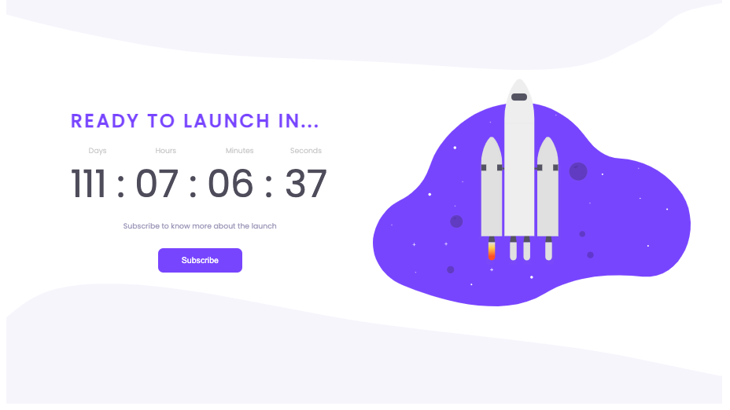
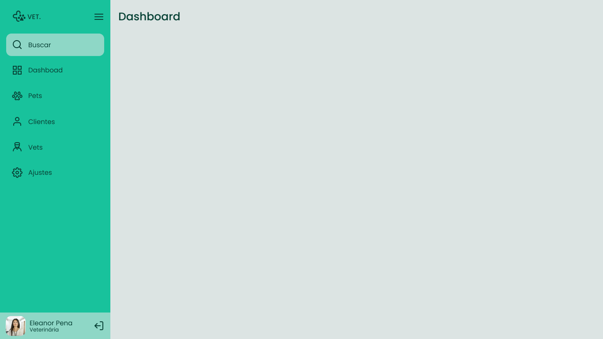

<h1>🚀 Rocketseat Challenges 🚀</h1>
<h3>
A repository to solve Rocketseat`s challenges using HTML, CSS and JavaScript.
</h3>

<h2>Portfolio</h2>

On this challenge we use HTML, CSS and JavaScript to create a portfolio and curriculum web page

<ul>
<li>Display flex</li>
<li>Display grid</li>
<li>Variables</li>
<li>Responsive design</li>
<li>Github API</li>
</ul>

  

Click <a href="https://www.figma.com/file/gDvQeSFni1g8lS0tj4BM8Y/Portfolio-%E2%80%A2-Desafio-Discover-(Copy)?type=design&node-id=0-1&t=NfiyX6RLGXRe2bpT-0" target="_blank">here</a> to see the project on Figma.

<h2>Social Tree</h2>

On this challenge we use HTML, CSS and JavaScript to create a page with links to social media

<ul>
<li>Display flex</li>
<li>Lists</li>
<li>Variables</li>
<li>Github API</li>
</ul>

  

Click <a href="https://www.figma.com/file/n4UQcRx6YLY1WVFXAPqfqM/Social-Tree-%E2%80%A2-Desafio-Discover-(Community)?type=design&node-id=113-4&t=NfiyX6RLGXRe2bpT-0" target="_blank">here</a> to see the project on Figma.

<h2>RocketNews</h2>

On this challenge we use HTML, CSS and JavaScript to create a page where you can save your e-mail to a data base and receive news

<ul>
<li>Form</li>
<li>Variables</li>
<li>Display grid</li>
<li>Absolute positioning</li>
<li>Local Storage</li>
</ul>

  

Click <a href="https://www.figma.com/file/seX4TAPQ4BK2Jg2ixFdGOK/RocketNews-%E2%80%A2-Desafio-Discover-(Community)-(Copy)?type=design&t=cqEIYc369KgkGwsj-0" target="_blank">here</a> to see the project on Figma.

<h2>Pricing Table</h2>

On this challenge we use HTML and CSS to create a page where you can hover over three different options of service plans.

<ul>
<li>Variables</li>
<li>Display grid</li>
<li>Absolute positioning</li>
<li>Responsive design</li>
<li>Hover effects</li>
</ul>

  

Click <a href="https://www.figma.com/file/wIB8DOXT70X0ABy5RuyGES/Pricing-Table-%E2%80%A2-Desafio-Discover-(Community)-(Copy)?type=design&node-id=203-68&t=cqEIYc369KgkGwsj-0" target="_blank">here</a> to see the project on Figma.

<h2>Theme Switcher</h2>

On this challenge we use HTML, CSS and JavaScript to create a page where you can toggle beetwen light and dark theme.

<ul>
<li>Variables</li>
<li>Absolute positioning</li>
<li>Transiton effects</li>
<li>Event listenner</li>
</ul>

  

  

Click <a href="https://www.figma.com/file/WMxNPZzs4xaqDWA89dbcAD/Theme-Switcher-%E2%80%A2-Desafio-Discover-(Community)-(Copy)?type=design&node-id=302-12&t=XGdyJKau8v3qfKAV-0" target="_blank">here</a> to see the project on Figma.

<h2>Countdown</h2>

On this challenge we use HTML, CSS and JavaScript to create a page where you can see a countdown timer, open a form and subscribe to an event.

<ul>
<li>Variables</li>
<li>Absolute positioning</li>
<li>Display flex</li>
<li>Display grid</li>
<li>Form</li>
<li>Functions</li>
<li>Date constructor</li>
<li>Math operations</li>
<li>Event listenner</li>
<li>setInterval()</li>
</ul>

  

  

Click <a href="https://www.figma.com/file/QmyVeqicFdQvB9h6pso8PB/Countdown-%E2%80%A2-Desafio-Discover-(Community)-(Copy)?type=design&node-id=0-1&t=tcs5sMeDsOMEoyc7-0" target="_blank">here</a> to see the project on Figma.

<h2>Sidebar</h2>

On this challenge we use HTML, CSS and JavaScript to create a page where you can open and close a sidebar menu by clicking the menu button.

<ul>
<li>Variables</li>
<li>Absolute positioning</li>
<li>Display flex</li>
<li>Display grid</li>
<li>Transition effects</li>
<li>Functions</li>
<li>Event listenner</li>
<li>setTimeout()</li>
<li>ClassList functions</li>
</ul>

  

  

Click <a href="https://www.figma.com/file/XpKYVpQ4HvdgZomdYyuzAM/Sidebar-%E2%80%A2-Desafio-Discover-(Community)-(Copy)?type=design&node-id=1-2&t=1hcw07gpoPUUjZdF-0" target="_blank">here</a> to see the project on Figma.

<h2>Login Form</h2>

On this challenge we use HTML, CSS and JavaScript to create a login page where the user can type e-mail and password to login.

<ul>
<li>Form</li>
<li>Variables</li>
<li>Absolute positioning</li>
<li>Display flex</li>
<li>Display grid</li>
<li>Arrow Functions</li>
<li>Event listenner</li>
<li>Responsive display</li>
<li>Change input property</li>
</ul>

  

  

Click <a href="https://www.figma.com/file/JGif6EpVwrzgc0PsF9R21D/Login-Form-%E2%80%A2-Desafio-Discover-(Community)-(Copy)?type=design&node-id=222-63&t=ptZfBzsM8lkbENcf-0" target="_blank">here</a> to see the project on Figma.

<h2>Rocket Shoes</h2>

On this challenge we use HTML, CSS and JavaScript to create e-comerce page where the user can see an amazing shoe offer and click the to see it bigger.

<ul>
<li>Variables</li>
<li>Absolute positioning</li>
<li>Display flex</li>
<li>Display grid</li>
<li>iframe</li>
<li>Responsive display: Desktop, tablet and mobile.</li>
<li>Arrow Functions</li>
<li>Event listenner</li>
<li>ForEach()</li>
</ul>

  

Click <a href="https://www.figma.com/file/djTzJdtHNOuYnLj5aSHcML/RocketShoes-%E2%80%A2-Desafio-Discover-(Community)-(Copy)?type=design&node-id=0-1&t=O7h0IuMfdzhZiO3A-0" target="_blank">here</a> to see the project on Figma.

<h2>Rocket Blog</h2>

On this challenge we use HTML and CSS to create a blog page.

<ul>
<li>Variables</li>
<li>Absolute positioning</li>
<li>Display flex</li>
<li>Transition</li>
<li>Pseudo selectors</li>
</ul>

  

Click <a href="https://www.figma.com/file/rbs2gY9kzlsojXuyyFs367/RocketBlog-%E2%80%A2-Desafio-Discover-(Community)-(Copy)?type=design&node-id=312-152&mode=design&t=afl17qb79SSaH1eA-0" target="_blank">here</a> to see the project on Figma.

<h2>Rocket Coffee</h2>

On this challenge we use HTML, CSS and JavaScript to create a coffee shop landing page.

<ul>
<li>Variables</li>
<li>Absolute positioning</li>
<li>Display flex</li>
<li>Pseudo selectors</li>
<li>Responsive design</li>
<li>Functions</li>
<li>Event listeners</li>
</ul>

  

  
  

Click <a href="https://www.figma.com/file/T239BVEBnwjO8aZ0QfZ183/RocketCoffee-%E2%80%A2-Desafio-Discover-(Community)-(Copy)?node-id=317%3A228&mode=dev" target="_blank">here</a> to see the project on Figma.

